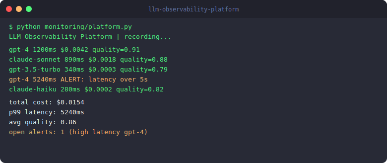

# LLM Observability Platform

[](https://python.org)
[](LICENSE)
[](https://github.com/Krishna89287/llm-observability-platform/actions)
[](https://github.com/Krishna89287/llm-observability-platform)

Production observability for LLM applications — cost, latency, quality, hallucination tracking

**Stack:** Python · Prometheus · Grafana · OpenTelemetry · FastAPI · PostgreSQL




## Architecture


## Why This Project Exists

Most teams ship AI features and then find out something is wrong from a user. This platform turns that around — catching issues before users see them.

The three metrics that matter most in production LLM systems:

**Cost** — LLM API costs are invisible until they are not. A single prompt change that increases token usage by 2x doubles your monthly bill. Per-request cost tracking with per-model breakdown makes this visible in real time rather than at the end of the billing cycle.

**Latency** — average latency is misleading. P99 latency is what users experience on bad days. The platform tracks latency distributions per model and alerts when P99 crosses the threshold, not when average latency does.

**Quality** — automated coherence, completeness, and safety scoring for every response. Quality degradation is the hardest problem to catch because it does not show up in error logs — it shows up in users quietly stopping using the product.

All three metrics feed into Prometheus so they appear on the same Grafana dashboards as the rest of your infrastructure observability.


## Demo

```
$ python monitoring/llm_monitor.py

LLMMonitor initialized
CostCalculator loaded: 6 providers

Recording 5 LLM calls...
✅ gpt-4 | 1200ms | $0.0042 | quality=0.91
✅ claude-3-sonnet | 890ms | $0.0018 | quality=0.88
✅ gpt-3.5-turbo | 340ms | $0.0003 | quality=0.79
⚠️  gpt-4 | 5240ms | $0.0089 | ALERT: HIGH LATENCY
✅ claude-3-haiku | 280ms | $0.0002 | quality=0.82

Dashboard Metrics:
  total_calls: 5
  total_cost_usd: $0.0154
  avg_latency_ms: 1590ms
  p99_latency_ms: 5240ms
  active_alerts: 1
  model_breakdown:
    gpt-4: 2 calls, $0.0131
    claude-3-sonnet: 1 call, $0.0018
    claude-3-haiku: 1 call, $0.0002
```


## Quick Start

```bash
git clone https://github.com/Krishna89287/llm-observability-platform.git
cd llm-observability-platform
pip install -r requirements.txt
cp .env.example .env
make run
```

## Running Tests

```bash
make test
```

## Contributing

See [CONTRIBUTING.md](CONTRIBUTING.md) for guidelines.

Built by [Krishna Gove](https://github.com/Krishna89287) · [LinkedIn](https://www.linkedin.com/in/krishna-reddy-327463222)
