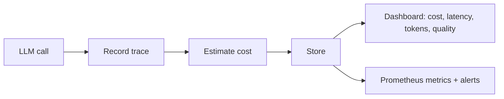
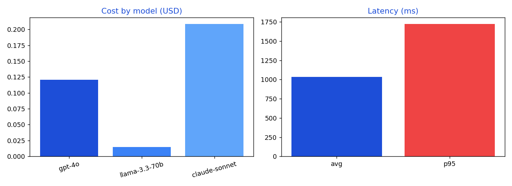

# LLM Observability Platform

Logs a trace for every LLM call (model, tokens, latency, answer quality), estimates
cost from token counts, and exposes a dashboard of cost, latency percentiles, token
usage and faithfulness, plus Prometheus metrics for alerting.

## Why it is useful for companies
Once an LLM feature ships, the questions are immediate: what is it costing, how slow
is it, and are answers staying accurate. This turns those into tracked numbers per
model, so teams can control spend, catch latency regressions, and watch quality,
rather than flying blind.

## What it does
- Records a trace per call and estimates cost from a per-model price table
- Dashboard: total cost, average and p95 latency, total tokens, average faithfulness, cost by model
- Prometheus metrics for calls and latency

## Quickstart
```bash
make install
make run     # http://localhost:8070
curl -s -X POST localhost:8070/trace -H "content-type: application/json" \
  -d '{"model":"gpt-4o","input_tokens":500,"output_tokens":200,"latency_ms":800,"faithfulness":0.9}'
curl -s localhost:8070/dashboard | python3 -m json.tool
```

## Stack
Python, FastAPI, in-memory trace store, cost model, Prometheus, Docker, GitHub Actions CI, Pytest.

## License
MIT

## Workflow diagram



## Dashboard output



A real dashboard snapshot is in [examples/sample_output.json](examples/sample_output.json).
